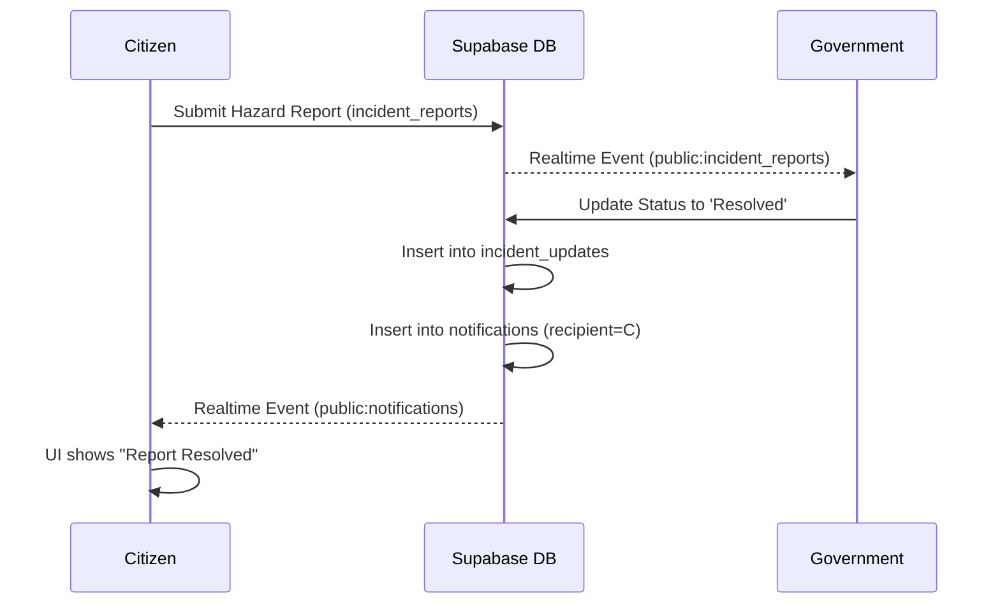

# RakshaNav Project Summary

## 1. PROJECT OVERVIEW
- **Project Name**: RakshaNav
- **One-line Description**: A smart city safety and urban navigation ecosystem.
- **Detailed Purpose**: RakshaNav provides safe route navigation and crowdsourced hazard reporting for citizens, and supplies municipal authorities with real-time operational data.
- **Problem Solved**: Overcoming unsafe navigation and disconnected civic reporting mechanisms.
- **Target Users**: Citizens, Government (Municipal Operations), Enterprise (Fleet Managers - planned), and Admins (planned).
- **Current Implementation Status**: Demo-ready MVP
- **Major Capabilities**: Safe route analysis (via OSRM, Overpass API, Open-Meteo, and Gemini AI for explanation), real-time live tracking with shareable links, civic hazard reporting, and role-based operational dashboards.
- **Status Key**: 
  - ✅ IMPLEMENTED: Functionality exists and is connected to the database.
  - ⚠️ PARTIALLY IMPLEMENTED: UI exists with basic backend support but missing full features.
  - ❌ PLANNED/NOT IMPLEMENTED: Stubs or placeholders exist.

## 2. USER ROLES
The application supports four primary roles, defined in the `profiles` table:
1. **Citizen**
   - **Authentication**: Fully implemented.
   - **Accessible Features**: Safe Navigation, Gemini AI Assistant, Live Tracking, Report Hazard, SOS (internal only), Community Reports, Profile Settings.
   - **Permissions**: Can read/write their own data (`user_id = auth.uid()`).
2. **Government**
   - **Authentication**: Implemented via dynamic organization signup (`government_organizations`).
   - **Accessible Features**: Command Center, Live Reports, Ward Monitoring (placeholder text removed, awaits V2 data).
   - **Permissions**: Approved members can view public hazard reports and update report statuses.
3. **Enterprise** (❌ Not Implemented)
   - **Status**: The `/enterprise` route exists, but all major views (Live Operations, Commute Analytics, Alerts) render empty `Placeholders.jsx` components.
4. **Admin** (❌ Not Implemented)
   - **Status**: The `/admin` route exists, but all views render empty `Placeholders.jsx` components.

## 3. APPLICATION ARCHITECTURE
- **Frontend**: React 18 SPA built with Vite. Uses Tailwind CSS for styling and Context API for state management.
- **Backend (Database)**: Supabase providing PostgreSQL, GoTrue Auth, Realtime WebSockets, and Row Level Security (RLS).
- **Backend (API)**: A custom Express.js server (`/server`) is strictly required in production to proxy requests to Google Gemini AI API, Open-Meteo, and Overpass API to protect API keys and handle complex routing logic.
- **Maps & Routing**: MapLibre GL JS (via `react-map-gl`), Leaflet (via `react-leaflet`), and OSRM (Open Source Routing Machine).

## 4. TECH STACK
| Technology | Purpose | Where Used |
|---|---|---|
| React 18 | UI Framework | Entire Frontend |
| Vite | Build Tool & Dev Server | `vite.config.js`, `package.json` |
| Supabase JS | Database, Auth, Realtime | `src/lib/supabase.js`, `src/contexts/AuthContext.jsx` |
| Tailwind CSS | Styling | UI Components, Pages |
| MapLibre GL & Leaflet | Maps & Visualization | SafeNavigation, LiveTracking, Dashboards |
| Google Generative AI | AI Intelligence | `server/services/geminiService.js` |
| Express.js | Backend Proxy / API | `server/index.js` |
| React Router DOM | Routing | `src/App.jsx` |
| OSRM | Route Generation | `server/controllers/routeController.js` |
| Overpass API | POI Data (Police, Hospitals) | `server/services/routeFeatureService.js` |
| Open-Meteo | Weather Data | `server/controllers/routeController.js` |

## 5. DIRECTORY STRUCTURE
- `/src/components/`: Reusable UI elements (ProtectedRoutes, Navbar, Sidebar).
- `/src/contexts/`: React Context providers (`AuthContext.jsx`, `AIContext.jsx`).
- `/src/hooks/`: Custom React hooks (`useGemini.js`).
- `/src/layouts/`: Dashboard wrapper layouts.
- `/src/pages/`: Route entry points, organized by role.
- `/src/services/`: Supabase database interaction layer.
- `/server/`: Express backend containing routing logic (`routeController.js`), safety algorithms (`SafetyEngine.js`), and Gemini proxy (`geminiService.js`).
- `/supabase/migrations/`: SQL definitions for database schema and Row Level Security.

## 6. ROUTING
- **Configuration**: `src/App.jsx`
- **Public Routes**: `/login`, `/signup`, `/government-signup`, `/live/:token`
- **Protected Onboarding**: `/onboarding`
- **Citizen Routes**: `/dashboard`, `/dashboard/navigation`, `/dashboard/report`, `/dashboard/tracking`, `/dashboard/emergency`
- **Government Routes**: `/government`, `/government/reports`, `/government/reports/:id`
- **Enterprise Routes**: `/enterprise` (redirects to Placeholders)
- **Admin Routes**: `/admin` (redirects to Placeholders)

*Note: Previous AI tool references to obsolete routes like `/navigate` have been corrected to `/dashboard/navigation`.*

## 7. AUTHENTICATION
- **Implementation**: Supabase GoTrue Auth (Email/Password).
- **OAuth**: Google OAuth is configured in Supabase but not implemented in the frontend UI.
- **Flow**: User signs up -> `auth.users` row created -> Postgres Trigger creates a `public.profiles` row with role `unassigned` -> User logs in -> Redirected to `/onboarding` -> User selects role -> Profile updated -> Redirected to dashboard.
- **Session**: Handled automatically via local storage by Supabase.

## 8. USER PROFILE SYSTEM
- **Entities**: 
  - `auth.users` (Supabase managed).
  - `public.profiles` (id references `auth.users(id)`).
- **Trigger**: Relies on `on_auth_user_created` trigger in Postgres.
- **Status**: Tested and functional for Citizens and Government.

## 9. DATABASE SCHEMA
- **`profiles`**: Stores `id` (UUID), `role`, `full_name`, `phone`, `profile_completed`.
- **`incident_reports`**: Stores citizen hazard reports. Includes `category`, `description`, `lat`, `lng`, `status`, `image_url`.
- **`incident_updates`**: Timeline of actions taken on reports.
- **`sos_events`**: Active emergencies triggered by users.
- **`live_sessions`** / **`live_locations`**: Tracks active shareable GPS telemetry.
- **`notifications`** / **`notification_reads`**: Global broadcast system and direct alerts.
- **`government_organizations`** / **`government_members`**: RBAC for municipal authorities.
- **`emergency_contacts`** / **`medical_profile`**: Citizen SOS data.

## 10. ROW LEVEL SECURITY (RLS)
- **Implementation**: Enabled on all primary tables.
- **Citizen Policies**: Citizens are permitted to `INSERT` into `incident_reports`, but constrained by `auth.uid() = user_id` (or anonymous).
- **Government Policies**: Authorized to `UPDATE` `incident_reports` via the `government_members` role checks.
- **Security Check**: The application does not rely on frontend-only authorization. Supabase strictly enforces `user_id` constraints on all inserts and updates.

## 11. CITIZEN FEATURES
- ✅ **Dashboard**: Overview of quick actions and active metrics.
- ✅ **Safe Navigation**: OSRM-based routing with real safety scoring.
- ✅ **AI Safety Assistant**: Chatbot capable of navigating the app.
- ✅ **Live Tracking**: Real-time GPS sharing with generated shortlinks.
- ✅ **Report Hazard**: Form to submit issues to the `incident_reports` table.
- ⚠️ **Trip History / Saved Places**: UI exists, database integration is present but minimally utilized.
- ✅ **Emergency/SOS**: Button to trigger internal system alerts (no external dispatch).

## 12. SAFE NAVIGATION
- **Geocoding**: Nominatim (OSM).
- **Routing**: OSRM.
- **Safety Scoring**: 
  - The Express backend (`SafetyEngine.js`) calculates a normalized score out of 100 based on exact weights.
  - **Inputs**: Uses the Overpass API for police/hospital proximity (`routeFeatureService.js`), Open-Meteo for live weather, and Supabase for active hazard reports near the polyline.
  - **Status**: Fully implemented. Scoring is data-driven, NOT simulated or hardcoded.
  - **AI Explanation**: The computed metrics are fed to Gemini AI *only* to generate a conversational explanation of the final score, not to calculate the score itself.

## 13. GEMINI AI
- **Model**: `gemini-2.5-flash` (fallback to `gemini-1.5-flash`).
- **Integration**: Accessed strictly through the Node/Express backend to protect `GEMINI_API_KEY`.
- **Features**: 
  - **Copilot**: Outputs XML tags (e.g. `<action type="navigate" target="/dashboard/navigation" />`) to trigger frontend React Router changes.
  - **Route Analysis**: Generates short safety summaries based on factual backend metrics.

## 14. REPORTING SYSTEM
- **Flow**: ✅ Implemented.
  1. Citizen creates report via `/dashboard/report`.
  2. Data is inserted to `incident_reports`.
  3. Government reviews on `/government/reports`.
  4. Government updates status to "Resolved".
  5. Realtime database trigger updates the citizen.

## 15. EMERGENCY / SOS
- **Trigger**: User hits SOS button.
- **Flow**: ⚠️ Partially Implemented.
  1. Starts a Live Tracking Session (generates token).
  2. Inserts record into `sos_events`.
  3. Inserts `critical` alert into `notifications` table containing the user's location and tracking link.
- **Critical Limitation**: External dispatch to Twilio SMS, WhatsApp, or Police APIs is **NOT IMPLEMENTED**. It relies solely on the internal database notification system.

## 16. NOTIFICATIONS
- **Architecture**: A central `notifications` table handles direct messages (`recipient_type = 'user'`) and broadcasts (`recipient_type = 'all'`).
- **Realtime**: `notificationService.js` subscribes to PostgreSQL changes and updates the UI instantly using Supabase Realtime.

## 17. GOVERNMENT SYSTEM
- ✅ **Command Center**: Fetches real-time KPIs directly from the `incident_reports` table (simulated/hardcoded data has been purged).
- ✅ **Live Reports**: Functional Kanban board to process citizen complaints.
- ❌ **Ward Monitoring / Infrastructure / Analytics**: Render empty states or placeholders.

## 18. ENTERPRISE SYSTEM
- ❌ **Status**: Not implemented. Renders placeholders.

## 19. ADMIN SYSTEM
- ❌ **Status**: Not implemented. Renders placeholders.

## 20. MAP SYSTEM
- **Libraries**: MapLibre GL JS and React Leaflet.
- **Map Tiles**: CartoDB Dark Matter.

## 21. EXTERNAL SERVICES
- **Supabase**: Primary Database and Auth.
- **Google Gemini API**: AI Services.
- **OSRM**: Route generation.
- **Nominatim**: Geocoding.
- **Overpass API**: Infrastructure safety data (police, hospitals).
- **Open-Meteo**: Weather data.

## 22. ENVIRONMENT VARIABLES
- `VITE_SUPABASE_URL`: Supabase project URL (Frontend & Backend).
- `VITE_SUPABASE_ANON_KEY`: Supabase public anon key (Frontend & Backend).
- `GEMINI_API_KEY`: Google AI Key (Backend only).

## 23. DEPLOYMENT
- **Architecture**: The application requires TWO running servers in production:
  1. The static React build (Vite).
  2. The Express.js backend (`/server/index.js`) to process routes, execute Overpass queries, and securely call Gemini.
- **Status**: The repository supports local development (`npm run dev:client` + `npm run dev:server`). A production deployment must host both services.

## 24. CURRENT KNOWN ISSUES
- **HIGH**: External SOS Dispatch is missing. SOS currently only notifies users internally.
- **HIGH**: Production deployment requires hosting a custom Express server alongside the React frontend, adding infrastructure complexity.
- **MEDIUM**: Enterprise and Admin roles are incomplete placeholders.
- **LOW**: The `liveTrackingService.js` relies on `navigator.geolocation`, which requires HTTPS in production.

## 25. SECURITY AUDIT SUMMARY
- **API Keys**: Gemini key is safely isolated in the backend. 
- **RLS**: Row Level Security is actively enforcing `user_id` constraints, preventing horizontal data escalation.
- **Authorization**: Role-based access control successfully blocks unauthorized users from accessing the `/government` and `/dashboard` routes.

## 26. DATA FLOW DIAGRAMS

## 27. IMPORTANT FUNCTIONS
- `useGemini.js -> sendMessage`: Orchestrates the AI chatbot, streaming responses, and parsing `<action type="navigate">` tags.
- `SafetyEngine.js -> calculateRouteSafety`: Calculates the data-driven safety score using real external datasets.
- `AuthContext.jsx -> fetchProfile`: Resolves the user's role and dictates the routing flow upon login.

## 28. CURRENT FEATURE MATRIX
| Feature | Citizen | Enterprise | Government | Admin |
|---|---|---|---|---|
| Authentication | ✅ | ✅ | ✅ | ✅ |
| Role Onboarding | ✅ | ✅ | ✅ | ✅ |
| Dashboards | ✅ | ❌ | ✅ | ❌ |
| Safe Navigation | ✅ | ❌ | ❌ | ❌ |
| Hazard Reporting | ✅ | ❌ | ✅ | ❌ |
| AI Assistant | ✅ | ❌ | ❌ | ❌ |
| Live Tracking | ✅ | ❌ | ❌ | ❌ |
| Emergency SOS | ⚠️ | ❌ | ❌ | ❌ |

## 29. DEVELOPMENT GUIDELINES
- **Backend Dependency**: Do not attempt to call Gemini or Overpass API directly from the React frontend to avoid exposing secrets or exceeding browser limitations.
- **Placeholders**: If completing Enterprise or Admin roles, start by replacing the exports in `Placeholders.jsx`.

## 30. FINAL PROJECT STATUS
RakshaNav is a **Demo-Ready MVP**. The core Citizen and Government pathways—specifically safe navigation, AI assistance, live tracking, and civic reporting—are fully functional and powered by real data sources. However, the application is not "production-ready" because it lacks critical features such as external SOS dispatch (Twilio/SMS integration) and requires the completion of the Enterprise and Admin dashboards.

---

## Audit Metadata
- **Audit Date**: 2026-08-08
- **Overall Project Status**: Demo-ready MVP
- **Core Production-Ready Areas**: Authentication, Role-based Routing, Safe Navigation Engine, Database RLS, Citizen/Government Reporting Flow.
- **Partially Implemented Areas**: Internal SOS Notifications, Trip History.
- **Not Implemented Areas**: External SMS Dispatch, Enterprise Dashboard, Admin Dashboard.
- **High-Priority Findings**: The Express backend must be continuously hosted alongside the frontend for Gemini and safety metrics to function.
- **Recommended Next Steps**: Implement Twilio/WhatsApp integration in the backend for SOS dispatch, and build out the Enterprise fleet views.
