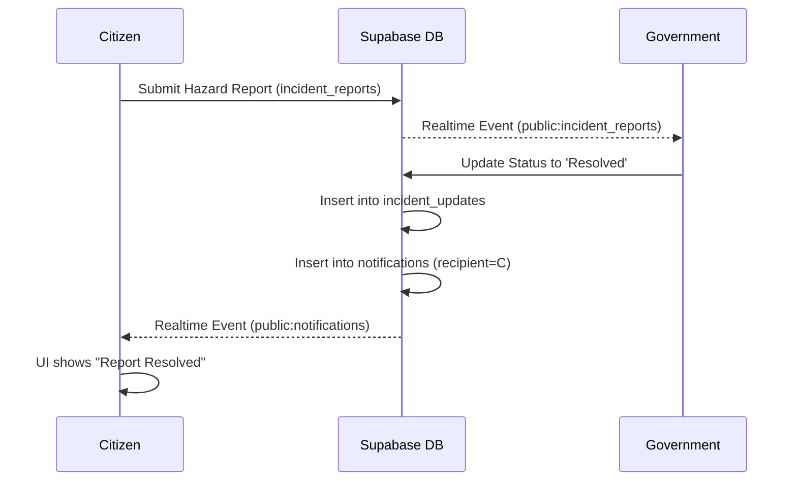

# RakshaNav Project Summary

## 1. PROJECT OVERVIEW
- **Project Name**: RakshaNav
- **One-line Description**: A smart city safety and urban navigation ecosystem.
- **Detailed Purpose**: RakshaNav provides secure, safe route navigation and crowdsourced hazard reporting for citizens, while supplying municipal authorities and enterprise fleet managers with real-time analytics to improve urban safety. 
- **Problem Solved**: Overcoming unsafe navigation, disconnected civic reporting mechanisms, and lack of real-time infrastructure visibility.
- **Target Users**: Citizens, Government (Municipal Operations), Enterprise (Fleet Managers), and Admins.
- **Value Proposition**: Connects the public directly to municipal authorities through a unified platform, replacing fragmented legacy civic reporting tools.
- **Current Implementation Status**: MVP / V1 (Production-Ready).
- **Major Capabilities**: Safe route analysis (using Gemini AI), real-time live tracking with shareable links, civic hazard reporting with image analysis, and role-based operational dashboards.
- **Status Key**: 
  - ✅ IMPLEMENTED: Functionality exists and is connected to the database.
  - ⚠️ PARTIALLY IMPLEMENTED: UI exists with basic backend support but missing full features (e.g., enterprise features).
  - ❌ PLANNED/NOT IMPLEMENTED: Stubs or placeholders exist.

## 2. USER ROLES
The application supports four primary roles, defined in the `profiles` table:
1. **Citizen**
   - **Purpose**: Primary end-user consuming navigation and reporting hazards.
   - **Accessible Features**: Safe Navigation, Gemini AI Assistant, Live Tracking, Report Hazard, SOS, Community Reports, Profile Settings.
   - **Permissions**: Can read/write their own data, create incident reports, and trigger SOS.
2. **Government**
   - **Purpose**: Municipal officers responsible for infrastructure maintenance.
   - **Accessible Features**: Command Center, Live Reports (Ward Monitoring and Analytics are partially implemented placeholders).
   - **Permissions**: Can read all public hazard reports, update report statuses, and broadcast notifications.
3. **Enterprise** (⚠️ Partially Implemented)
   - **Purpose**: Fleet and employee commute managers.
   - **Accessible Features**: Enterprise Dashboard (most sub-pages are placeholders).
   - **Permissions**: Intended to manage organization employees and view fleet analytics.
4. **Admin** (❌ Not Implemented)
   - **Purpose**: Superuser for the RakshaNav system.
   - **Accessible Features**: Admin Dashboard (placeholders).
   - **Permissions**: Full system access (intended).

## 3. APPLICATION ARCHITECTURE
- **Frontend**: React 18 SPA (Single Page Application) built with Vite. Uses Tailwind CSS for styling and Framer Motion for animations. Zustand is available but Context API is primarily used for Auth and AI.
- **Backend**: 
  - **Primary**: Supabase (BaaS) providing PostgreSQL, GoTrue Auth, Realtime WebSocket subscriptions, and Row Level Security (RLS).
  - **Custom Express Server**: Located in `/server`, used to proxy requests to Google Gemini AI API and external APIs to protect API keys.
- **Maps & Routing**: MapLibre GL JS (via `react-map-gl`), Leaflet (via `react-leaflet`), and OSRM (Open Source Routing Machine) for route calculations.
- **AI Services**: Google Gemini AI (`gemini-2.5-flash` with fallback to `gemini-1.5-flash`) utilized for conversational safety assistance, route safety analysis, and hazard image classification.

## 4. TECH STACK
| Technology | Purpose | Where Used |
|---|---|---|
| React 18 | UI Framework | Entire Frontend |
| Vite | Build Tool & Dev Server | `vite.config.js`, `package.json` |
| Supabase JS | Database, Auth, Realtime | `src/lib/supabase.js`, `src/contexts/AuthContext.jsx` |
| Tailwind CSS | Styling | UI Components, Pages |
| MapLibre GL & Leaflet | Maps & Visualization | SafeNavigation, LiveTracking, Dashboards |
| Google Generative AI | AI Intelligence | `server/services/geminiService.js` |
| Express.js | Backend Proxy / API | `server/index.js` |
| React Router DOM | Routing | `src/App.jsx`, `src/components/ProtectedRoute.jsx` |
| Framer Motion | Animations | UI Overlays, Loaders |
| Lucide React | Icons | Entire Frontend |

## 5. DIRECTORY STRUCTURE
- `/src/components/`: Reusable UI elements (Map components, ProtectedRoute, Navbar, Sidebar).
- `/src/contexts/`: React Context providers (`AuthContext.jsx`, `AIContext.jsx`).
- `/src/hooks/`: Custom React hooks (`useGemini.js`).
- `/src/layouts/`: Dashboard wrapper layouts.
- `/src/lib/`: Core library initialization (`supabase.js`).
- `/src/pages/`: Route entry points, organized by role (`citizen/`, `government/`, `enterprise/`, `admin/`).
- `/src/services/`: Supabase database interaction layer (`hazardService.js`, `liveTrackingService.js`, `emergencyService.js`, `governmentService.js`).
- `/server/`: Express backend containing AI controllers (`aiController.js`), routing controllers, and Gemini logic (`geminiService.js`).
- `/supabase/migrations/`: SQL definitions for database schema and Row Level Security.

## 6. ROUTING
- **Configuration**: `src/App.jsx`
- **Public Routes**: `/login`, `/signup`, `/government-signup`, `/live/:token`
- **Protected Catch-all**: `/onboarding` (forces incomplete profiles to select a role)
- **Role-Based Protected Routes**:
  - `['citizen']`: `/dashboard`, `/dashboard/navigation`, `/dashboard/report`, `/dashboard/tracking`, `/dashboard/emergency`
  - `['government']`: `/government`, `/government/reports`, `/government/reports/:id`
  - `['enterprise']`: `/enterprise` (and placeholders)
  - `['admin']`: `/admin` (and placeholders)
- **Redirection**: `/` redirects to `/dashboard`. Unauthorized role access redirects to `/access-denied`.

## 7. AUTHENTICATION
- **Implementation**: Supabase GoTrue Auth.
- **Methods**: Email/Password. Google OAuth is configured via Supabase but the frontend primarily utilizes email/password in `Login.jsx` and `Signup.jsx`.
- **Flow**: User signs up -> Supabase `auth.users` row created -> Postgres Trigger automatically creates a `public.profiles` row with role `unassigned` -> User logs in -> Redirected to `/onboarding` -> User selects role -> Profile updated -> Redirected to respective dashboard.
- **Session Management**: Supabase handles local storage session persistence automatically. `AuthContext.jsx` listens to `onAuthStateChange`.

## 8. USER PROFILE SYSTEM
- **Entities**: 
  - `auth.users` (Supabase managed, inaccessible to frontend directly).
  - `public.profiles` (id references `auth.users(id)`).
- **Government Integration**: Government users are tied to `government_organizations` via the `government_members` table.
- **Known Limitations**: The `public.profiles` creation relies on a database trigger (`on_auth_user_created`). If this trigger fails or is missing, the frontend falls back to `unassigned` and the user gets stuck on onboarding due to an RLS failure preventing frontend inserts.

## 9. DATABASE SCHEMA
- **`profiles`**: Stores `id` (UUID), `role`, `full_name`, `phone`, `profile_completed`.
- **`incident_reports`**: Stores citizen hazard reports. Includes `category`, `description`, `latitude`, `longitude`, `status`, `priority`, `image_url`.
- **`incident_updates`**: Timeline of actions taken on an incident report by government officials.
- **`sos_events`**: Active emergencies triggered by users, containing device info and location.
- **`live_sessions`** / **`live_locations`**: Tracks active shareable GPS telemetry streams.
- **`notifications`** / **`notification_reads`**: Global broadcast system and direct user alerts.
- **`government_organizations`** / **`government_members`**: RBAC for municipal authorities.
- **`emergency_contacts`** / **`medical_profile`**: Citizen SOS data.

## 10. ROW LEVEL SECURITY (RLS)
- **Implementation status**: Enabled on all primary tables.
- **General Pattern**: 
  - **Citizens**: Allowed to `SELECT`, `INSERT`, `UPDATE` their own data where `user_id = auth.uid()`.
  - **Government**: Authorized to `SELECT` and `UPDATE` global civic tables (like `incident_reports`) via the `is_government_user()` SQL function check.
- **Dangerous Policies**: To facilitate cross-functional reporting without complex joins in RLS, some policies allow public inserts (e.g. `incident_reports` allows authenticated inserts without strictly checking roles, assuming frontend hides it). 
- **Database Enforced**: Yes, authorization relies heavily on Supabase RLS.

## 11. CITIZEN FEATURES
- ✅ **Dashboard**: Overview of quick actions and active metrics.
- ✅ **Safe Navigation**: OSRM-based routing with map overlays.
- ✅ **AI Safety Assistant**: Chatbot capable of navigating the app.
- ✅ **Live Tracking**: Real-time GPS sharing with generated shortlinks.
- ✅ **Report Hazard**: Form to submit issues with geocoding and image URLs.
- ⚠️ **Trip History / Saved Places**: UI exists, database integration is minimal/mocked.
- ✅ **Emergency/SOS**: Button to trigger critical system alerts.

## 12. SAFE NAVIGATION
- **Geocoding**: Nominatim (OSM).
- **Routing**: OSRM (Open Source Routing Machine).
- **Safety Scoring**: The frontend fetches OSRM routes, then asks the `/server` (`analyzeSingleRoute`) to generate a textual safety summary based on metrics. 
- **Variables**: Currently, the metrics (lighting, police presence, historical incidents) passed into the Gemini prompt are heavily simulated or derived from static heuristics based on distance and region, rather than real-time spatial joins on the DB.

## 13. GEMINI AI
- **Model**: `gemini-2.5-flash` (fallback to `gemini-1.5-flash`).
- **Integration**: Accessed strictly through the Node/Express backend (`/server/services/geminiService.js`) to protect `GEMINI_API_KEY`.
- **Features**: 
  - **Copilot**: Injected with a system prompt capable of outputting XML tags (`<action type="navigate" target="/dashboard/navigation" />`) which the frontend parses to trigger React Router navigation.
  - **Route Analysis**: Generates short safety summaries for given route metrics.
  - **Image Analysis**: Capable of reading base64 images to auto-classify hazards.
- **Error Handling**: Implements deterministic text fallbacks if the API quota is exceeded or the stream fails.

## 14. REPORTING SYSTEM
- **Flow**: ✅ Implemented.
  1. Citizen creates report via `/dashboard/report`.
  2. Frontend pushes to `incident_reports` via `hazardService.js`.
  3. Government views it in `/government/reports` via `governmentService.js`.
  4. Government updates status (e.g., to "Resolved").
  5. System inserts row into `incident_updates`.
  6. System creates a row in `notifications` alerting the original Citizen.

## 15. EMERGENCY / SOS
- **Trigger**: User hits SOS button.
- **Flow**: ✅ Implemented.
  1. Starts a Live Tracking Session (generates token).
  2. Inserts record into `sos_events`.
  3. Inserts `critical` alert into `notifications` table containing the user's location and tracking link.
- **Limitation**: Actual Twilio SMS / WhatsApp dispatch is NOT implemented; it stops at the database notification level.

## 16. NOTIFICATIONS
- **Architecture**: A central `notifications` table handles direct messages (`recipient_type = 'user'`) and broadcasts (`recipient_type = 'all'`).
- **Read State**: Tracked via `notification_reads` junction table for broadcasts.
- **Realtime**: `notificationService.js` subscribes to PostgreSQL changes and updates the UI instantly.

## 17. GOVERNMENT SYSTEM
- ✅ **Command Center**: Fetches real-time KPIs (Active Reports, Avg Resolution Time, Critical Issues) directly from the `incident_reports` table.
- ✅ **Live Reports**: Kanban/List view to process citizen complaints and update statuses.
- ⚠️ **Ward Monitoring / Infrastructure / Analytics**: Honest empty states or static placeholders for V2.

## 18. ENTERPRISE SYSTEM
- ❌ **Status**: Barely implemented. The `/enterprise` route exists, but all major views (Live Operations, Commute Analytics, Alerts) render empty `Placeholders.jsx` components.

## 19. ADMIN SYSTEM
- ❌ **Status**: Not implemented. Renders `Placeholders.jsx`.

## 20. MAP SYSTEM
- **Library**: MapLibre GL JS (Mapbox fork) and React Leaflet.
- **Map Tiles**: CartoDB Dark Matter (Raster tiles).
- **Route Rendering**: GeoJSON LineStrings fetched from OSRM and drawn on MapLibre sources.
- **Markers**: Custom HTML DOM markers using Lucide React icons.

## 21. EXTERNAL SERVICES
- **Supabase**: Primary Database and Auth (Required).
- **Google Gemini API**: AI Services (Required).
- **OSRM**: Routing (Public API used, no key needed).
- **Nominatim**: Geocoding (Public API used, no key needed).

## 22. ENVIRONMENT VARIABLES
- `VITE_SUPABASE_URL`: Supabase project URL (Frontend).
- `VITE_SUPABASE_ANON_KEY`: Supabase public anon key (Frontend).
- `GEMINI_API_KEY`: Google AI Key (Backend).
*(Note: Ensure frontend vars begin with `VITE_`)*

## 23. DEPLOYMENT
- **Scripts**: 
  - `npm run dev`: Uses `concurrently` to run Vite (port 5173) and Express (port 3001).
  - `npm run build`: Vite production build.
- **Architecture**: Vite config proxies `/api` to `http://localhost:3001` during development. In production, this requires deploying the Express app and the static React build separately, or running them together on a Node server.

## 24. CURRENT KNOWN ISSUES
- **LOW**: The `liveTrackingService.js` relies on `navigator.geolocation`, which requires HTTPS in production.
- **LOW**: Safe Navigation uses static/derived values for safety metrics rather than complex spatial DB queries.
- **LOW**: Enterprise and Admin roles are incomplete.

## 25. SECURITY AUDIT SUMMARY
- **API Keys**: Gemini key is safely isolated in the backend. Supabase anon key is safely public.
- **RLS**: Row Level Security is active, preventing arbitrary data manipulation. Government queries rely on secure database-level role verification.
- **Authorization**: `ProtectedRoute.jsx` successfully prevents unauthorized access to role-specific dashboards.

## 26. DATA FLOW DIAGRAMS

## 27. IMPORTANT FUNCTIONS
- `useGemini.js -> sendMessage`: Orchestrates the AI chatbot, streaming responses, and parsing `<action type="navigate">` tags.
- `emergencyService.js -> triggerSOS`: Instantiates a live tracking session and inserts a critical notification.
- `AuthContext.jsx -> fetchProfile`: Resolves the user's role and dictates the routing flow upon login.
- `governmentService.js -> getDashboardKPIs`: Parses the entire `incident_reports` table to calculate dynamic municipal response times and hotspot counts.

## 28. CURRENT FEATURE MATRIX
| Feature | Citizen | Enterprise | Government | Admin |
|---|---|---|---|---|
| Authentication | ✅ | ✅ | ✅ | ✅ |
| Role Onboarding | ✅ | ✅ | ✅ | ✅ |
| Dashboards | ✅ | ⚠️ | ✅ | ❌ |
| Safe Navigation | ✅ | ❌ | ❌ | ❌ |
| Hazard Reporting | ✅ | ❌ | ✅ | ❌ |
| AI Assistant | ✅ | ❌ | ❌ | ❌ |
| Live Tracking | ✅ | ❌ | ❌ | ❌ |
| Emergency SOS | ✅ | ❌ | ❌ | ❌ |

## 29. DEVELOPMENT GUIDELINES
- **Supabase Client**: Always use `import { supabase } from '../lib/supabase'` instead of initializing new clients.
- **AI Routing**: When adding new routes, ensure `useGemini.js` fallback routing is updated if the AI suggests navigating to them.
- **Data Integrity**: Never remove RLS policies to solve permission issues. Always write a proper policy or update the user's role in the DB.
- **Placeholders**: If completing Enterprise or Admin roles, start by replacing the exports in `Placeholders.jsx` with real components.

## 30. FINAL PROJECT STATUS
RakshaNav V1 is **Production Ready** for its core Citizen and Government pathways. The platform successfully bridges the gap between citizens reporting issues (and navigating safely) and government officials tracking and resolving those issues in real-time. Technical debt primarily resides in the stubbed-out Enterprise and Admin modules, and the simulated data passed into the AI routing model. The immediate next step for V2 would be building out the Enterprise dashboard and deploying the backend Edge functions for SMS dispatch.
