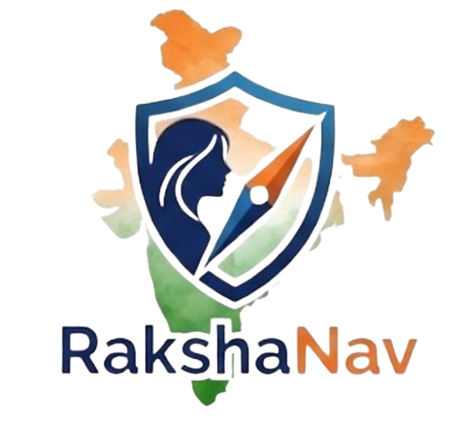
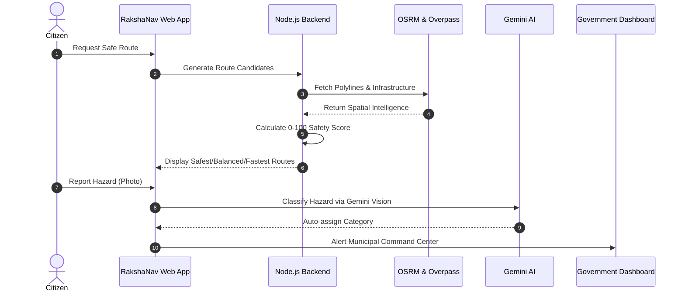

<div align="center">
  
  
  <h1>🛡️ RakshaNav</h1>
  <p><strong>Navigate Safer. Move Smarter.</strong></p>
  
  <p>A safety-first navigation platform that goes beyond the fastest route to help citizens discover safer routes using real-world safety and infrastructure intelligence.</p>

  <p>
    <a href="https://rakshanav.vercel.app">Live Demo</a> • 
    <a href="#-getting-started">Documentation</a> • 
    <a href="https://github.com/tanmays2k6/rakshanav/issues">Report Bug</a> • 
    <a href="https://github.com/tanmays2k6/rakshanav/issues">Request Feature</a>
  </p>

  <p>
    
    
    
    
    
  </p>
</div>

---

## 📑 Table of Contents

- [Overview](#-overview)
- [Why RakshaNav?](#-why-rakshanav)
- [Key Features](#-key-features)
- [Product Preview](#-product-preview)
- [Architecture](#-architecture)
- [Tech Stack](#-tech-stack)
- [Safety Intelligence](#-safety-intelligence)
- [Safety-Aware Routing](#-safety-aware-routing)
- [Government Safety Command Center](#-government-safety-command-center)
- [Women's Safety](#-womens-safety)
- [Business Model](#-business-model)
- [Potential Applications](#-potential-applications)
- [Project Structure](#-project-structure)
- [Getting Started](#-getting-started)
- [Environment Variables](#-environment-variables)
- [Running Locally](#-running-locally)
- [API Overview](#-api-overview)
- [Security & Privacy](#-security--privacy)
- [Roadmap](#-roadmap)
- [Contributing](#-contributing)
- [License](#-license)
- [Team](#-team)

---

## 📖 Overview

Traditional navigation optimizes for speed. **RakshaNav optimizes for safety.**

Conventional navigation systems prioritize the shortest or fastest routes, frequently routing pedestrians and commuters through poorly lit streets, deserted areas, or high-incident corridors. Safety can vary significantly between nearby streets, and poor lighting or infrastructure drastically increases risk. 

RakshaNav provides a data-driven civic safety and intelligent navigation platform. We empower citizens with safety-aware mobility while providing governments and municipal authorities with actionable infrastructure intelligence to eliminate urban dark spots.

---

## ⚡ Why RakshaNav?

| Traditional Navigation | RakshaNav |
| :--- | :--- |
| **Fastest route** | **Safety-aware route** |
| Distance/time focused | Safety + mobility focused |
| Static map data | Dynamic safety + infrastructure signals |
| Limited citizen feedback | Citizen safety intelligence & AI reporting |
| Navigation only | Navigation + safety ecosystem |

---

## ✨ Key Features

| 🛣️ Safety-Aware Navigation | 💡 Infrastructure Intelligence |
| :--- | :--- |
| Candidate routes are evaluated using a 0–100 Safety Engine based on lighting, transit access, isolation, and weather. | Spatial extraction of streetlights, police, and hospitals along routes. Municipal gap analysis. |
| **🚨 Emergency Safety** | **📊 Safety Analytics** |
| 5-sec SOS countdown, live tracking URL generation, and one-touch quick dial for emergency services. | Ward-level safety monitoring and government command center for incident queues. |
| **🤖 AI Safety Assistant** | **👥 Community Intelligence** |
| Gemini-powered copilot for safety guidance, hazard photo classification, and auto-text expansion. | Live hazard reporting, public feed, status tracking, and community voting. |

---

## 📸 Product Preview


---

## 🏗️ Architecture



---

## 🛠️ Tech Stack

- **Frontend**: React 18, Vite, TailwindCSS, Zustand, Framer Motion
- **Backend**: Node.js, Express
- **Database / Auth / Realtime**: Supabase (PostgreSQL)
- **Mapping Engine**: Leaflet, React Leaflet, CartoDB (Dark Matter)
- **Routing & Infrastructure**: OSRM, OpenStreetMap Nominatim, Overpass API
- **AI Engine**: Google Gemini 3.6 Flash / Vision
- **Weather Integration**: Open-Meteo API

---

## 🛡️ Safety Intelligence

RakshaNav evaluates route safety using a multi-factorial algorithm. The **Safety Engine** computes a score from 0–100 based on weighted normalized sub-scores:

- **Emergency Score (25%)**: Proximity to Police stations, Hospitals, Pharmacies, and CCTV.
- **Lighting Score (20%)**: Daytime conditions vs. nighttime commercial density and streetlights.
- **Community Score (20%)**: Active hazard reports decayed by severity, age, and resolution status.
- **Road Class Score (10%)**: Higher weight for primary/trunk highways over unclassified roads.
- **Transit Score (10%)**: Proximity to metro stations and bus stops.
- **Weather & Isolation (10%)**: Penalties for rain, fog, high winds, or nighttime isolation.
- **Historical (5%)**: Historical incident density.

---

## 🗺️ Safety-Aware Routing

1. **User enters origin and destination.**
2. **RakshaNav fetches candidate routes** via OSRM.
3. **Safety signals are evaluated** asynchronously using Overpass (POIs) and Supabase (hazards).
4. **Routes receive a Safety Score** via our algorithm.
5. **User compares options** side-by-side (`Safest`, `Balanced`, `Fastest`).

---

## 🏛️ Government Safety Command Center

RakshaNav is built for city-wide civic integration. The platform provides authorized municipal personnel with:
- City-level and ward-level safety insights
- Live incident management queues
- Infrastructure gap analytics (e.g. unlit street density)
- Official advisory dispatch portal

> **Privacy Principle**: RakshaNav is designed around privacy-by-design. Normal citizen activity is represented through aggregated/anonymized insights, while precise real-time location access is restricted to legitimate safety workflows, tokenized live shares, and authorized personnel.

---

## 👩 Women's Safety

A core focus of RakshaNav is improving mobility confidence for women. By factoring in poorly lit areas, historical safety hotspots, and isolation risks, the engine actively routes users away from vulnerable corridors at night. Furthermore, the **Live Tracking** feature generates temporary tokenized URLs that women can share with trusted contacts, allowing real-time monitoring without requiring the viewer to create an account.

---

## 💼 Business Model

- **B2B (Enterprise)**: Employee commute monitoring, corporate fleet integration, geofence alerts, and enterprise safety analytics *(Prototype)*.
- **B2G (Government)**: Municipal safety monitoring dashboards, ward-level infrastructure planning tools, and public advisory broadcast systems.

---

## 🌍 Potential Applications

- Women commuting at night
- Delivery & logistics riders
- Employee transportation
- Smart cities & municipal infrastructure management
- Public safety & law enforcement operations

---

## 📁 Project Structure

```text
rakshanav/
├── src/                   # Frontend Application
│   ├── components/        # Reusable UI elements
│   ├── config/            # Application config
│   ├── contexts/          # React Context (Auth, AI)
│   ├── hooks/             # Custom React Hooks
│   ├── pages/             # Route components (Citizen, Gov, Admin)
│   ├── services/          # API & Business Logic Services
│   └── main.jsx           # React entry point
├── server/                # Express Backend
│   ├── controllers/       # Route & logic controllers
│   ├── middleware/        # Error & Request handling
│   ├── routes/            # Express API routes
│   └── services/          # Backend services (Safety Engine, Overpass, AI)
├── supabase/
│   └── migrations/        # Database schemas and RLS policies
├── public/                # Static assets (Logos, icons)
├── package.json           # Frontend dependencies
└── README.md              # Project documentation
```

---

## 🚀 Getting Started

### Prerequisites
- Node.js (v18+)
- npm
- Supabase account & project

### Clone the Repository
```bash
git clone https://github.com/tanmays2k6/rakshanav.git
cd rakshanav
```

### Install Dependencies
```bash
# Install frontend dependencies
npm install

# Install backend dependencies
cd server
npm install
cd ..
```

---

## 🔐 Environment Variables

Create a `.env` file in the root directory and add the following variables:

<details>
<summary>Click to view required Environment Variables</summary>

```env
# Frontend (Required)
VITE_SUPABASE_URL=your_supabase_project_url
VITE_SUPABASE_PUBLISHABLE_KEY=your_supabase_anon_key
VITE_APP_URL=http://localhost:5173

# Backend (Optional, but recommended)
GEMINI_API_KEY=your_google_gemini_api_key
PORT=3001
```

</details>

*Note: Database migrations located in `supabase/migrations` must be executed on your Supabase instance to enable proper RLS and trigger functionality.*

---

## 💻 Running Locally

Run both frontend and backend concurrently using the root package script:

```bash
npm run dev
```

| Service | URL |
| :--- | :--- |
| **Frontend App** | [http://localhost:5173](http://localhost:5173) |
| **Backend API** | [http://localhost:3001](http://localhost:3001) |

---

## 🔌 API Overview

<details>
<summary>Click to view API endpoints</summary>

| Method | Endpoint | Description |
| :--- | :--- | :--- |
| `GET` | `/api/route/calculate` | Candidate route generator & Safety Engine |
| `POST` | `/api/route/metrics` | Asynchronous route metrics & scoring |
| `GET` | `/api/nearby` | Overpass POI spatial search for safe havens |
| `POST` | `/api/ai/chat` | Gemini SSE chat stream |
| `POST` | `/api/ai/analyze-hazard-image`| Gemini Vision photo classification |
| `GET` | `/api/weather` | Open-Meteo live weather data proxy |
</details>

---

## 🔒 Security & Privacy

- **Authentication & Authorization**: Supabase Auth (Email/Google OAuth) with strict Role-Based Access Control (`citizen`, `government`, `admin`, `enterprise`).
- **Row Level Security (RLS)**: Enforced across all PostgreSQL tables ensuring citizens can only access their private trip histories, medical profiles, and tracking tokens.
- **Location Privacy**: Community maps utilize database views (`public_incident_view`) that filter out personally identifiable information. Government access is restricted to macro-level trends and actionable hazard reports.
- **Trigger Security**: Backend triggers execute with `SECURITY DEFINER` preventing privilege escalation.

---

## 🛣️ Roadmap

- [x] Safety-aware route prototype
- [x] Citizen safety interface (SOS, Hazard Reporting)
- [x] Government Dashboard (Command Center, Analytics)
- [x] Live Location Tracking
- [x] AI Safety Assistant (Gemini)
- [ ] Mobile application (Capacitor / React Native)
- [ ] Offline Map Caching
- [ ] Turn-by-Turn Voice Navigation
- [ ] Enterprise / Fleet integration completion

---

## 🤝 Contributing

Contributions are welcome! Please follow these steps:
1. Fork the repository
2. Create your feature branch (`git checkout -b feature/amazing-feature`)
3. Commit your changes (`git commit -m 'feat: add amazing feature'`)
4. Push to the branch (`git push origin feature/amazing-feature`)
5. Open a Pull Request

---

## 📄 License

License information will be added soon.

---

## 👨‍💻 Team

Team information coming soon.

---

## 🛡️ Building safer mobility with RakshaNav

Because the best route isn't always the fastest route — it's the one that gets you there safely.

⭐ **Star the repository if you find the project interesting!**
