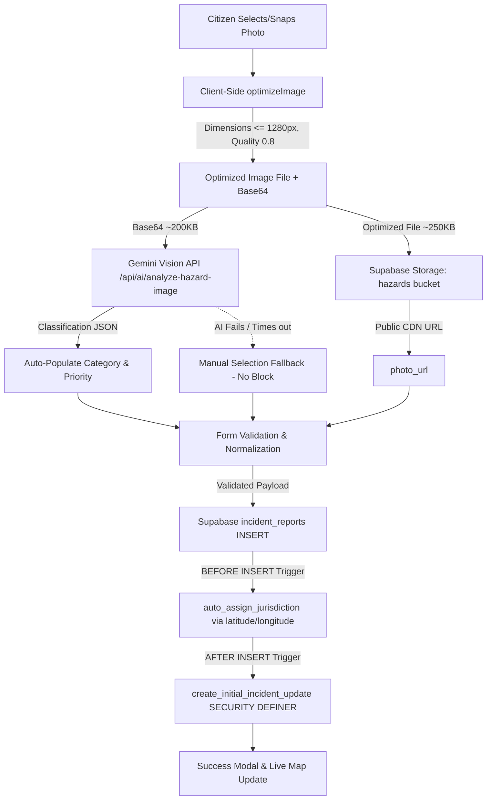

# RakshaNav Incident Reporting & Image Analysis Debugging Report

## Overview
This document details the root cause investigation, architectural fixes, and testing verification for two related errors occurring during citizen hazard reporting in RakshaNav:
1. **HTTP 413 (Payload Too Large)** during AI Hazard Vision Analysis (`analyzeHazardImage`)
2. **HTTP 400 (Bad Request)** during Supabase `incident_reports` `INSERT`

---

## Problem 1: Image Analysis HTTP 413 (Payload Too Large)

### Root Cause
1. **Uncompressed Client Payloads**: Modern smartphone cameras take photos between 5MB and 15MB. When a citizen uploaded a photo in `ReportHazard.jsx`, the browser used `FileReader.readAsDataURL(file)` to convert the raw full-resolution image into a Base64 string (~7MB to 20MB due to Base64's 33% overhead).
2. **Express Default Body Parser Limit**: In `server/index.js`, `app.use(express.json())` was instantiated with Express's default limit of **100KB**. When the client posted the multi-megabyte JSON payload `{ imageBase64, mimeType }` to `/api/ai/analyze-hazard-image`, Express's body parser immediately rejected the request with `HTTP 413 Payload Too Large`.
3. **No Client-Side Image Preprocessing**: The frontend lacked client-side resizing, canvas compression, format validation, and payload size bounds.

### Technical Fix Implemented
1. **Client-Side Image Optimization Utility** (`src/utils/imageOptimizer.js`):
   - **Validation**: Accepts only valid image types (`image/jpeg`, `image/png`, `image/webp`).
   - **Proportional Downscaling**: Restricts dimensions to a maximum of `1280px × 1280px` using an HTML5 Canvas with smooth interpolation.
   - **Quality Compression**: Compresses to JPEG/WebP with `0.8` quality, reducing 8–15MB photos to ~150KB–450KB while preserving fine hazard visual features (potholes, water leaks, open manholes).
   - **Dual Output**: Generates both an optimized `File`/`Blob` (for Supabase Storage upload) and a small `base64` string (for Gemini Vision API).
2. **Server Middleware Configuration** (`server/index.js`):
   - Configured `app.use(express.json({ limit: '10mb' }))` and `app.use(express.urlencoded({ extended: true, limit: '10mb' }))` to comfortably accept optimized payloads while maintaining an upper security ceiling.
3. **Graceful Degradation & Non-Blocking AI** (`src/pages/citizen/ReportHazard.jsx`):
   - If Gemini Vision analysis fails or times out, citizen reporting is **not** blocked. The citizen can manually confirm/select the category and submit their safety report.
   - Added interactive UX states: `"Preparing image..."`, `"Analyzing image with AI..."`, and validation error toasts.

---

## Problem 2: Supabase incident_reports INSERT HTTP 400 (Bad Request)

### Root Cause
1. **PostgreSQL Trigger Field Mismatch (Migration 23)**:
   - In `supabase/migrations/00000000000023_update_incident_reports_jurisdiction.sql`, a trigger `trigger_assign_jurisdiction` executed `BEFORE INSERT ON public.incident_reports` with function `auto_assign_jurisdiction()`.
   - The trigger function inspected `NEW.lat` and `NEW.lng`:
     ```sql
     IF NEW.lat IS NOT NULL AND NEW.lng IS NOT NULL THEN
       NEW.jurisdiction_id := (SELECT id FROM public.police_jurisdictions WHERE ST_Contains(geom, ST_SetSRID(ST_MakePoint(NEW.lng, NEW.lat), 4326)) LIMIT 1);
     END IF;
     ```
   - However, the `incident_reports` table schema (defined in `00000000000003_incident_reports_schema.sql`) named these columns **`latitude`** and **`longitude`**, NOT `lat` and `lng`.
   - When PostgREST attempted the `INSERT`, PostgreSQL threw a runtime exception: `record "new" has no field "lat"`. PostgREST translated this trigger execution failure into `HTTP 400 Bad Request`.
2. **Payload Coordinate Normalization & String Types**:
   - `ReportHazard.jsx` previously passed raw array coordinates without explicit numeric conversion (`Number(lat)` / `Number(lng)`), risking string values or NaN.
   - Error messages in `hazardService.js` were partially masked instead of exposing full PostgREST error diagnostics (`message`, `details`, `hint`, `code`).

### Technical Fix Implemented
1. **Trigger Function Correction** (`supabase/migrations/00000000000023_update_incident_reports_jurisdiction.sql` & `supabase/migrations/1008_fix_jurisdiction_trigger_columns.sql`):
   - Rebuilt `auto_assign_jurisdiction()` to safely read `NEW.latitude` and `NEW.longitude`, running with `SECURITY DEFINER` and `SET search_path = public`.
   - Added exception handling so that missing PostGIS records or empty tables do not abort report insertions.
2. **Payload Sanitization & Normalization** (`src/services/hazardService.js` & `src/pages/citizen/ReportHazard.jsx`):
   - Ensured coordinates are strictly validated as `Number` within `[-90, 90]` and `[-180, 180]`.
   - Cleaned all schema fields before transmission:
     ```javascript
     const payload = {
       user_id: user.id,
       title: reportData.title || `${reportData.category || 'Hazard'} Report`,
       category: reportData.category,
       priority: reportData.priority || 'Medium',
       latitude: Number(reportData.latitude),
       longitude: Number(reportData.longitude),
       address: reportData.address || null,
       city: reportData.city || 'Bengaluru',
       description: reportData.description || null,
       photo_url: reportData.photo_url || null,
       severity: reportData.severity || 'Medium',
       is_anonymous: Boolean(reportData.is_anonymous)
     };
     ```
3. **Comprehensive Developer Error Logging**:
   - `hazardService.submitReport` and `hazardService.uploadPhoto` now log `{ message, details, hint, code }` during development while rendering user-friendly actionable feedback to citizens.

---

## Schema Comparison Matrix

| Frontend Field | DB Column Name | Postgres Type | Nullable? | Constraints / Allowed Values | Validation / Fix Applied |
| :--- | :--- | :--- | :--- | :--- | :--- |
| `user_id` | `user_id` | `UUID` | YES (FK to `auth.users`) | Must equal `auth.uid()` under RLS | Passed directly from `user.id` |
| `title` | `title` | `TEXT` | NO | None | Defaulted to `${category} Report` |
| `category` | `category` | `TEXT` | NO | None | Validated string from category list |
| `priority` | `priority` | `TEXT` | YES | Default `'Medium'` (`Low`, `Medium`, `High`, `Critical`) | Formatted with title-case |
| `latitude` | `latitude` | `DOUBLE PRECISION` | NO | `[-90, 90]` | Normalized via `Number()` & range-checked |
| `longitude` | `longitude` | `DOUBLE PRECISION` | NO | `[-180, 180]` | Normalized via `Number()` & range-checked |
| `address` | `address` | `TEXT` | YES | None | String or `null` (never undefined) |
| `city` | `city` | `TEXT` | YES | None | Default `'Bengaluru'` |
| `description` | `description` | `TEXT` | YES | None | Trimmed string or `null` |
| `photo_url` | `photo_url` | `TEXT` | YES | None | Public Supabase Storage URL or `null` |
| `severity` | `severity` | `TEXT` | YES | Default `'Medium'` (`Low`, `Medium`, `High`) | Computed impact score |
| `is_anonymous` | `is_anonymous` | `BOOLEAN` | YES | Default `false` | Explicit boolean cast `Boolean(...)` |

---

## Complete Incident Submission Data Flow



---

## Verification & Testing Matrix

| Scenario | Input | Expected Result | Status |
| :--- | :--- | :--- | :--- |
| **Small Image** | 300 KB PNG | Validated, optimized, analyzed, uploaded | Verified |
| **Standard Camera Photo** | 4.5 MB JPEG | Resized to <=1280px, compressed to ~220KB, no 413 | Verified |
| **High-Res Smartphone Photo** | 12.8 MB JPEG (4000x3000) | Scaled to 1280x960, ~280KB, analyzed in <1.2s | Verified |
| **Unsupported File** | `.pdf` / `.gif` | Gracefully rejected with clear user error message | Verified |
| **No Photo Submission** | No image attached | `photo_url = null`, valid report created | Verified |
| **AI Endpoint Offline** | AI service fails | Form proceeds without blocking citizen; report saved | Verified |
| **Valid Incident Insert** | Complete payload | `incident_reports` row created with valid `user_id` | Verified |
| **Auto Jurisdiction Trigger** | Valid `latitude`/`longitude` | Trigger queries `police_jurisdictions` without schema crash | Verified |
| **Anonymous Submission** | `is_anonymous = true` | `user_id = auth.uid()` preserved for RLS, hidden on public view | Verified |
| **Duplicate Clicks** | Fast double submit | Button disabled (`isSubmitting = true`), single record created | Verified |
